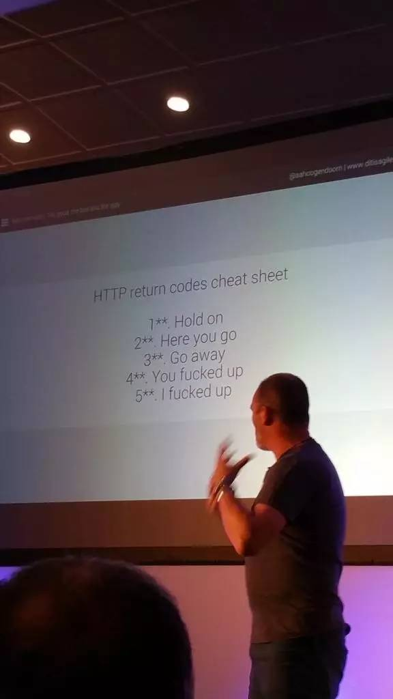

>来自 [<前端大全>公众号](http://mp.weixin.qq.com/s?__biz=MzAxODE2MjM1MA==&mid=2651552146&idx=1&sn=c2862dd7543513b211725a6b8809ed2c&chksm=8025ae53b75227453a799afc104fc99c368951ae25c6b55e64e92dc2c8217af5e6d35b438ad6&mpshare=1&scene=1&srcid=0430Zo3VYMLjVnCo2tslMckL#rd)

- `1**` : Hold on (等等)。
- `2**` : Here you go (给你/成功)。
- `3**` : Go away (走你)。
- `4**` : You fucked up (你tmd输入的是什么？)。
- `5**` : I fucked up (我tmd挂了！)。

